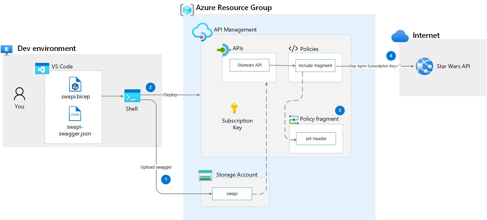

# Challenge 3: Use Bicep for deployment to APIM.

In this challenge you will use Bicep to deploy the Starwars API. The swagger definition for this API is in your storage account. Instead of adding a request header you will remove sensitive information from the outgoing call to the backend service using a Policy fragment. Policy fragments is a feature that let you create policies centrally and then reference them in your API's.

The following image illustrates the steps in this challenge
<br>

  

<br>

## Main objectives

- Deploy the Starwars API using Bicep from VS Code.
- Add a Policy fragment that removes the request header "Ocp-Apim-Subscription-Key" in the call to the backend service. 


## Activities

- Use Azure CLI to upload the swapi-swagger.json file that is in the root folder to your storage account in the container "swapi".

```bash
az storage blob upload -f .\swapi-swagger.json --account-name stg[POSTFIX]hack -c swapi
```
- Create a Bicep file in VS Code and place it in the infrastructure folder. Use the "existing" keyword to reference your APIM instance.
- Create a new API using Bicep, import the Starwars API from https://stg[YOUR POSTFIX]hack.blob.core.windows.net/swapi/swapi-swagger.json
- Add a subscription using Bicep and connect it to the SWAPI API.  
- Use the portal to create a Policy fragment that removes the request header "Ocp-Apim-Subscription-Key" from the outgoing call to the backend service.   
- Validate that the outgoing call doesn't expose the "Ocp-Apim-Subscription-Key" that is being used to authenticate against APIM. Use the test functionality in APIM and validate this by looking at the trace logs.    


## Definition of done

- Starwars API imported and subscription created using Bicep. 
- "Ocp-Apim-Subscription-Key" header removed from outgoing call to backend service.  


## Helpful links

- [Microsoft.ApiManagement service/apis reference](https://learn.microsoft.com/en-us/azure/templates/microsoft.apimanagement/service/apis?pivots=deployment-language-bicep)
- [Reuse policy configurations in your API Management policy definitions](https://learn.microsoft.com/en-us/azure/api-management/policy-fragments)

## Solution
- View the solution here, [Challenge 3 - Solution](solution3.md) 

## The challenges

* [Challenge 1: Setup the environment](challenge1.md)
* [Challenge 2: Get familiar with Azure API Management (APIM)](challenge2.md)
* [Challenge 3: Use Bicep for deployment to APIM](challenge3.md)
* [Challenge 4: Create a CI/CD GitHub Action and deploy to Container Apps](challenge4.md)
* [Challenge 5: Use the CI/CD GitHub Action to deploy changes to APIM](challenge5.md)
* [Challenge 6: Add a policy using Bicep](challenge6.md)
* [Challenge 7: Managing Development/Production environments.](challenge7.md)