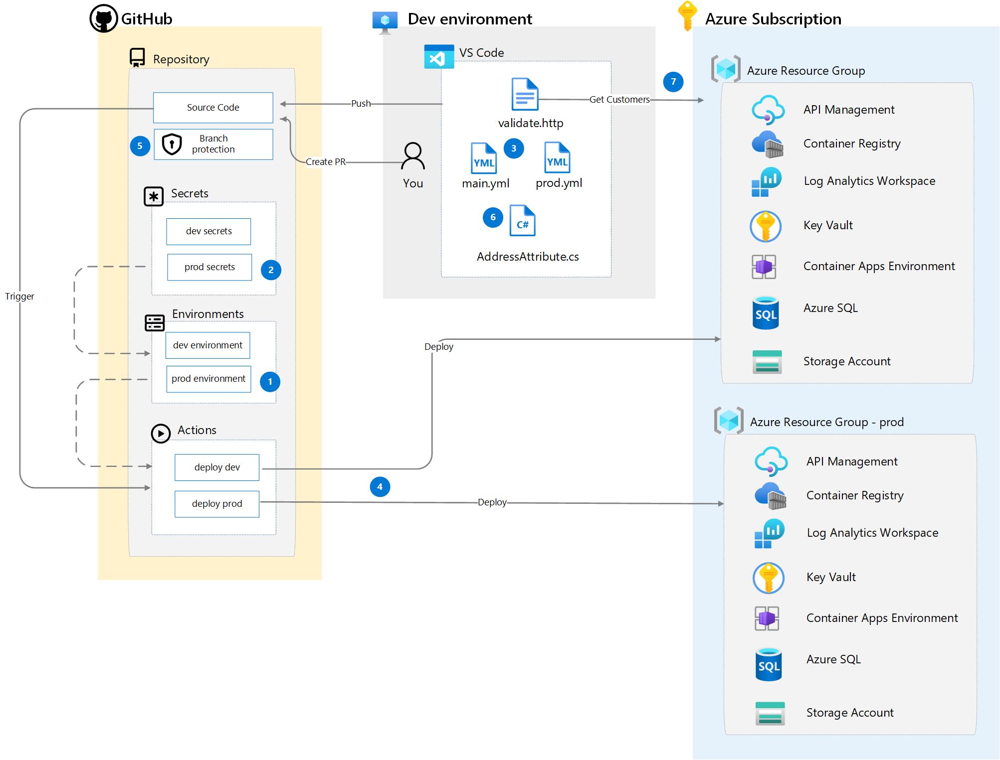

# Challenge 7: Use the CI/CD GitHub Action to deploy to a production environment.

You have completed a CI/CD workflow which will enable you to deploy changes in a fast an reliable way to a DEV environment. 
Now, it's time to move your API to production. After completing this challenge, you will have a new workflow that To validate this, you will create a new operation in the Customer API and deploy the changes using your finalized CI/CD workflow.   

The following image illustrates the steps in this challenge
 

  

 

## Main objectives

- Add a GitHub Environment to your GitHub repository to ensure that secrets for the production environment are stored separately 
- Modify the Github CI/CD Action to deploy to the production environment.
- Ensure that only approved changes are deployed to production

## Activities

- Create a GitHub Environment called 'prod'
- Create a resourcegroup or use the provided one with the naming convention "rg-[six letters]prod" e.g. "rg-wilnorprod"." in the northeurope Azure region. 
- Deploy infrastructure/main.bicep and validate that all services deployed successfully. 
- Add the following GitHub secrets to the 'prod' GitHub Environment

    - AZURE_BLOB_SAS_TOKEN - Use the created storage account. Create a SAS token for the container "apidefinitions" with read access. Use the value from the field "Blob SAS token".
    - AZURE_CREDENTIALS - Use the JSON output from the Azure CLI command "az ad sp create-for-rbac", set the scope to the previously created resourcegroup.
    - AZURE_RG - The name of the previously created resourcegroup.
    - AZURE_STORAGE_CONNECTION_STRING - The connection string to the created storage account, put the connection string inside **double quotes**. e.g. "[YOUR STORAGE ACCOUNT CONNECTION STRING]"
    - AZURE_SUBSCRIPTION - The subscription Id 
- Modify the deployment pipeline (or create a new one) so that secrets from prod GitHub environment are used to deploy to the production environment
- Protect the main branch by applying a branch protection rule which requires review before code is commited.
- Make a code change in a separate branch and validate that it gets deployed to 'dev' when it's commited.
- Merge a Pull Request to main and ensure that this triggers the production deployment workflow

## Definition of done

- A separate production environment with all requried infrastructure in Azure.
- A production GitHub Environment where secrets for the production Azure environment are stored.
- A complete CI/CD workflow using GitHub Actions for the Customer API that deploys to the production environment when a commit is done to the main branch.  
- A branch protection rule on the main branch ensuring that changes are reviewed before they are committed.
- An Environment protection rule on the 'prod' GitHub Environment, ensuring that only changes from main are allowed to be deployed to it.

## Helpful links

- [Using workflows in GitHub](https://docs.github.com/en/actions/using-workflows/about-workflows)
- [GitHub environment variables](https://docs.github.com/en/actions/learn-github-actions/environment-variables)
- [GitHub Environments](https://docs.github.com/en/actions/deployment/targeting-different-environments/using-environments-for-deployment)
- [Reusing GitHub workflows](https://docs.github.com/en/actions/using-workflows/reusing-workflows)

## Solution
- View the solution here, [Challenge 7 - Solution](solution7.md) 

## The challenges

* [Challenge 1: Setup the environment](challenge1.md)
* [Challenge 2: Get familiar with Azure API Management (APIM)](challenge2.md)
* [Challenge 3: Use Bicep for deployment to APIM](challenge3.md)
* [Challenge 4: Create a CI/CD GitHub Action and deploy to Container Apps](challenge4.md)
* [Challenge 5: Use the CI/CD GitHub Action to deploy changes to APIM](challenge5.md)
* [Challenge 6: Add a policy using Bicep](challenge6.md)
* [Challenge 7: Managing Development/Production environments.](challenge7.md)